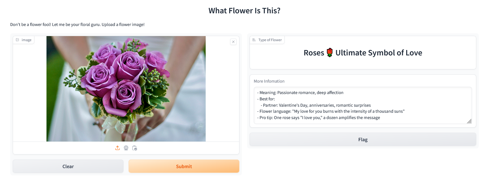

# Floral Gift Classifier 🌸

Welcome to the **Floral Gift Classifier**, a deep learning application designed to help users identify different types of flowers from images and discover their symbolic meanings. This project arose from the difficulty I faced when choosing the right flowers to gift my partner, so I decided to create an AI-powered solution to assist others facing the same challenge. Now, anyone can use this tool to select the perfect bouquet with confidence!

## Features
- **Accurate Flower Classification**: The core of the application is a highly accurate image classification model developed using **TensorFlow**. The model is based on **MobileNetV2**, which is known for being lightweight and optimized for speed and performance, making it suitable for deployment in environments with limited computational resources. Despite its efficiency, the model achieves an impressive accuracy of **92%**, ensuring reliable flower identification.

- **Symbolic Flower Meanings**: After classifying a flower, the app also provides its symbolic meaning. Whether you're looking for flowers to express love, friendship, or congratulations, this feature adds a thoughtful touch by explaining the traditional significance behind each flower.

## Tools Used
  - **MLFlow** is used for experiment tracking and version control of the model, making it easy to manage different versions and track model performance over time.
  - **Data Version Control (DVC)**: The project uses **DVC** to manage data pipelines efficiently. 
- **Gradio** provides a simple and intuitive web interface where users can upload flower images and interact with the classifier.
  - **Docker** containerizes the application, packaging the model and all necessary dependencies to ensure consistency across different environments.